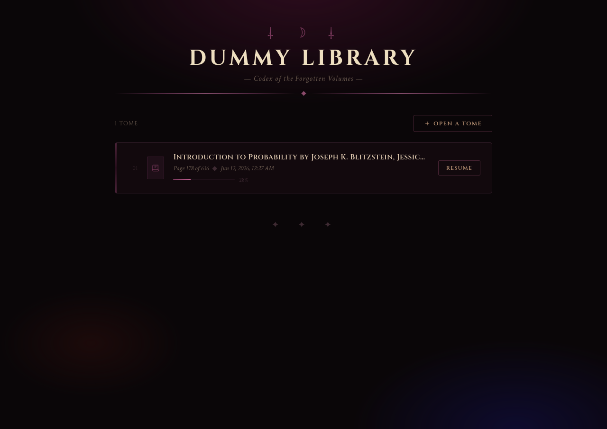

# Dummylib :b
---

A PDF reader that remembers where you left off automatically.

Open a pdf , close the tab , come back later and it remembers where you were.

**Automatic bookmarking** 
- saves the current page when you close the pdf 

**Resume anywhere** 
- dummy lib shows every book and last-read page;one click to resume

**Self contained**
- the whole frontend is embedded in the binary

**SQLite storeage**
- all your bookmarks live in a single portable file.


## Prerequisites
You only need a web browser. which if youre here it means you already have, I guess.


## How it works ?
You should pass the path of your pdf file into the bar and It will open that itself.

since the browser can't access your files path for security reasons you yourself should copy the path of your file and paste it to the dummylib to open it.

## 🚀 Getting Started (run it yourself)

for using this on linux you need to install `libayatana-appindicator-glib`

```bash
sudo apt install libayatana-appindicator-glib-dev   # Ubuntu/Debian or any other package manager your distro uses
```

### Option A: Download a pre-built binary (recommended)

- Go to the [Releases page](https://github.com/ArminEbrahimpour/dummyLib/releases) (TODO: add link)
- Grab the version for your OS (Linux, macOS, Windows)
- Make it executable (Linux/macOS: `chmod +x dummylib`)
- Run it: `./dummylib`
- Open your browser to `http://localhost:3333` – that’s your library.

### Option B: Build from source
You’ll need [Go 1.21+](https://go.dev/dl/).

```bash
git clone https://github.com/ArminEbrahimpour/dummyLib
cd dummylib
go mod download
go build -o dummylib ./cmd
./dummylib
```
